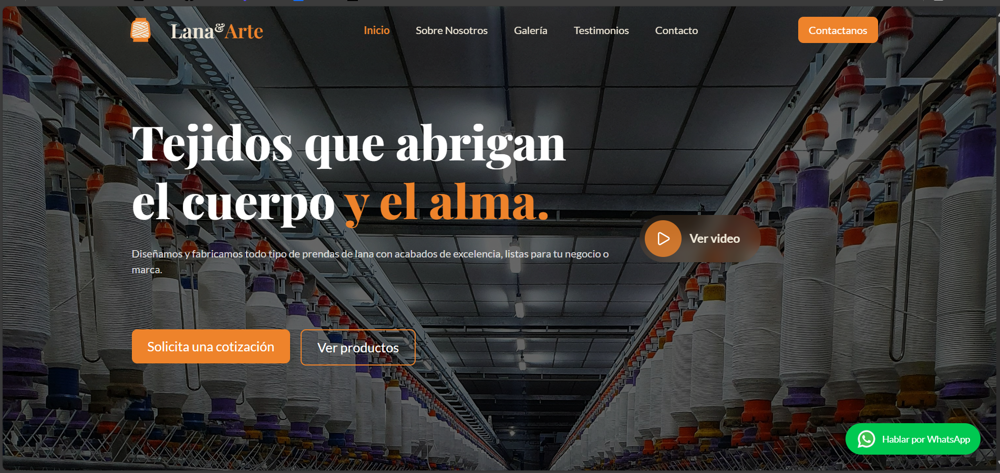

[⚠️ Suspicious Content] # 🌿 Lana&Arte - Landing Page

Landing page moderna y responsive diseñada para **Lana&Arte**, una textilería dedicada al arte en lana y tejidos artesanales.  
El objetivo de este proyecto es mostrar la identidad de la marca con un diseño atractivo, animaciones fluidas y una experiencia de usuario optimizada.

---

## 🚀 Tecnologías utilizadas

- ⚛️ **React** - Librería para la creación de interfaces.
- 🎨 **Tailwind CSS** - Estilos rápidos y responsivos.
- 🎬 **Framer Motion** - Animaciones fluidas y modernas.
- 📹 **Video embebido** - Reproducción de video dentro de la página.
- 🔗 **React Scroll** - Navegación entre secciones.

---

## ✨ Características

- Diseño **responsive** adaptable a móviles, tablets y desktop.
- Animaciones con **Framer Motion** para una experiencia dinámica.
- Botón interactivo para **reproducción de video** sin salir de la página.
- Optimización de imágenes y recursos para carga rápida.
- Implementación de **SEO básico** con meta tags.
- Vista previa personalizada al compartir en redes sociales.

---

## 📸 Preview



## Instalación y uso

```bash
git clone ...
cd nombre-proyecto
npm install
npm run dev
```

## 🌐 Demo

👉 Ver sitio en vivo https://aisakveliz.netlify.app/

## 📬 Contacto

- 👤 AISAK
- 💼 https://aisakveliz.netlify.app/
- 📧 aisakvelizdc@gmail.com

✨ Este proyecto forma parte de mi portafolio como desarrollador.